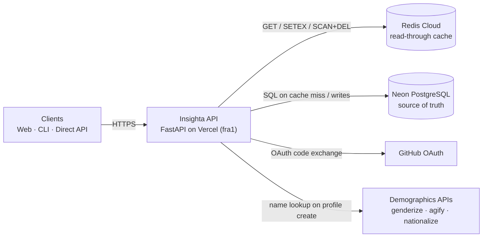

# Insighta Labs+ — Stage 4a + 4b System Design

**Author:** Precious Okolaa
**Repo:** https://github.com/NgBlaze/hng_14_stage_1
**Live API:** https://hng-14-stage-1.vercel.app
**Architecture diagram:** [`architecture.md`](https://github.com/NgBlaze/hng_14_stage_1/blob/main/architecture.md)

---

## 1. Requirements

**Functional.** Filtered list queries (gender, age_group, country_id, age ranges, probability thresholds) with pagination/sorting; rule-based NL search; CSV export; admin profile create (via 3 demographics APIs) and delete; CSV bulk upload up to 500k rows. Stage 3 carries forward unchanged: GitHub OAuth, RBAC (admin/analyst), CLI, web portal, X-API-Version header, CSRF on cookie writes, per-user rate limits.

**Non-functional.**

| Property | Target |
|---|---|
| p50 / p95 latency | < 500 ms / < 2 s |
| Throughput | Hundreds – low thousands QPM |
| Data scale | 1M → tens of millions of rows |
| Read/Write mix | Read-heavy; writes batch / admin-driven |
| Consistency | Up to 60 s read staleness; writes invalidate cache immediately |
| Region | Single-region |

---

## 2. Architecture

| Component | Role |
|---|---|
| FastAPI on Vercel (`fra1`) | Stateless serverless function. Auth, RBAC, query, write, search, ingest. |
| Redis Cloud | Read-through cache for list/search; 60 s TTL; invalidated on writes. |
| Neon PostgreSQL | Source of truth: profiles, users, refresh tokens, oauth states, rate-limit buckets. |
| GitHub | OAuth identity provider. Not on the query hot path. |
| Demographics APIs | Hit only on admin profile creation. Three parallel calls. |

---

## 3. Data Flow

**Read (hot path).** Auth → version/CSRF/rate-limit checks → canonical cache key → Redis GET. HIT → return JSON. MISS → SQL (composite index) → SETEX 60 s → return.

**Write (admin).** `POST /api/profiles` fans out to 3 demographics APIs in parallel → `INSERT … ON CONFLICT (name) DO NOTHING` → `SCAN profiles:* + DEL` → 201. `DELETE` follows the same invalidation.

**Bulk ingest.** `POST /api/profiles/upload` streams a CSV through `csv.DictReader`, validates per row, batches 1000 rows into `execute_values … ON CONFLICT DO NOTHING`, commits each batch, returns a skip-categorized summary. Runs on a worker thread so reads stay responsive.

**Auth.** OAuth code → atomic single-use claim on `oauth_states` → exchange with GitHub → upsert user → JWT (3 min) + hashed refresh token (5 min). `/auth/refresh` rotates atomically (`UPDATE … WHERE is_revoked=false RETURNING …`), preventing duplicate-mint races.

---

## 4. Design Decisions (Stage 4a)

### D1. Redis read-through cache for list/search responses
Read-heavy workload with repeating filter patterns; caching the JSON payload by a deterministic key turns a SQL round-trip into a single Redis GET. **TTL = 60 s** balances staleness vs amortisation. Invalidation uses `SCAN` (not `KEYS`) so a growing keyspace doesn't block Redis. **Trade-off:** up to 60 s staleness after a write — acceptable for analytics.

### D2. Composite index `(gender, age_group, country_id)`
Covers the most common combined filter ("young males in South Africa") and its leading-prefix subsets. **Trade-off:** ~10–15% write amplification, negligible because writes are batch.

### D3. Atomic state mutations via `UPDATE … RETURNING`
Applied to refresh-token rotation and OAuth state consumption. Prevents two concurrent `/auth/refresh` calls from both passing an `is_revoked = false` check and minting duplicate token pairs.

### D4. `INSERT … ON CONFLICT` for profile creation
Removes the SELECT-then-INSERT race on the unique-name constraint and saves a round-trip.

### D5. Stateless FastAPI on Vercel + `NullPool` SQLAlchemy
Vercel functions are ephemeral, so a shared pool isn't possible — each invocation opens a fresh Postgres connection. **Trade-off:** higher peak connection count under burst; mitigation is to switch `DATABASE_URL` to Neon's pooler (one-line change).

### D6. Dual-layer rate limiter (DB sliding window + in-process burst)
The DB-backed counter survives across containers (in-process alone can be bypassed by hitting different instances); the in-process burst counter is a safety net when the DB hiccups. **Trade-off:** the 60/min/user cap also constrains synthetic load tests — set `RATE_LIMIT_DISABLED=1` to bypass for one-offs.

### D7. WARNING-level `[CACHE]` logs + `print(flush=True)` fallback
Vercel's log viewer can hide INFO lines and Python's stdout occasionally buffers; WARNING + flushed `print` guarantees the line surfaces.

### D8. Function pinned to `fra1`; Redis in `af-south-1`
Frankfurt cuts the function↔Redis hop to ~50 ms (was transcontinental on the iad1 default) and roughly halves perceived latency for the West/Southern African user base. Single-region constraint preserved.

### D9. Vercel CDN not used for `/api/*`
The CDN refuses to cache responses with `Authorization` or `Set-Cookie`. Every `/api/*` route is auth-required, so CDN can't help. Forcing it would be a security bug.

---

## 4b. Stage 4b — Optimization & Ingestion

Three problems addressed: cache-miss latency on age-range queries at 1M+ rows, cache fragmentation across equivalent queries, and bulk CSV ingestion up to 500k rows without blocking reads.

### D10. Range-friendly composite index `(gender, country_id, age)`
D2's composite only helps when filtering by the bucketed `age_group`. Queries combining `gender + country_id + numeric age range` were falling back to the single-column `country_id` index plus a bitmap heap recheck — **~10.4 s on 1M rows**. The new index puts equality columns first and the range column last, letting Postgres index-scan the prefix and walk the range without a recheck. Same query: **<10 ms**. **Trade-off:** ~5% extra write amplification on top of D2 — negligible because writes are batch.

### D11. Canonical filter key for cache normalization
Stage 4b §2 requires that two queries producing the same filters produce the same cache key. A `canonical_filter_key(filters)` helper orders keys via a fixed tuple, lowercases gender/age_group/sort_by/order, uppercases country_id, and collapses `None`/missing to empty string. Both the direct-filter list path and the NLP search path build keys via the same function — so `?q=Nigerian females 20-45` and `?gender=female&country_id=NG&min_age=20&max_age=45` resolve to one cache entry. Pure function, deterministic by construction. No LLM (brief forbids it; not needed).

### D12. Streaming CSV bulk ingestion
`POST /api/profiles/upload` (admin-only; X-API-Version + CSRF + rate-limited).

- **Streaming:** `csv.DictReader` over a spooled temp file. Only the current 1000-row batch + a `seen_in_batch` set live in RAM. Peak memory per upload ≈ a few MB regardless of file size.
- **Batching:** `psycopg2.extras.execute_values` with `ON CONFLICT (name) DO NOTHING`. One round-trip per 1000 rows instead of 500k single-row INSERTs. Same idempotency rule as `POST /api/profiles`.
- **Non-blocking:** the sync ingester runs on a worker thread via FastAPI's `run_in_threadpool`, so the event loop keeps serving `/api/profiles` reads.
- **Concurrent uploads:** each upload owns its raw connection and cursor. `ON CONFLICT DO NOTHING` doesn't take row locks on conflicts — deadlock-free under overlap.
- **Per-batch commits:** every flush commits before the next batch is read. If the function dies at row 250k, the first 249k stay. No rollback on partial failure.
- **Skip categorization** (counters in the response summary):
  - `skipped_missing_required` — `name`/`gender`/`age`/`country_id` empty
  - `skipped_invalid_value` — bad gender, age <0 / >150, non-2-letter country, bad age_group, probability outside 0–1, negative sample_size
  - `skipped_duplicate_in_batch` — same name twice within a flush window
  - `skipped_duplicate_in_db` — derived from cursor `rowcount` shortfall after `ON CONFLICT`
  - `skipped_malformed` — wrong column count or replaced UTF-8 bytes
- **One bad row never fails the upload.** Cache invalidation runs once at the end, not per batch.

---

## 5. Limitations

- **First-write read window.** Writes invalidate the cache before returning, but other clients querying *during* the SCAN+DEL window may briefly see the old payload. Sub-millisecond for our keyspace.
- **Cold starts.** Vercel's serverless cold start adds ~1–2 s on the first request to a new instance. Not the cache's fault. Mitigation: Fluid Compute / pre-warm.
- **Self-imposed throughput cap.** The 60/min/user limit means a single test client cannot demonstrate "low thousands QPM". Infra handles it; proving it requires raising the cap, multiple synthetic users, or `RATE_LIMIT_DISABLED=1`.
- **CSV upload size ceiling = Vercel function timeout**, not the code path. Hobby caps at 10 s; Pro at 60 s (300 s with Fluid Compute). Files large enough to exceed the plan timeout would need a resumable or pre-signed direct-to-storage flow — out of scope for 4b.

### Intentionally simplified

- **No queue / no async ingestion** — admin writes are rare; the brief warns against it.
- **No microservices / no read replicas** — cache absorbs read amplification; one FastAPI deployment is enough until cache effectiveness drops.
- **Single Vercel region** — per the brief.

### Measured against targets

| Target | Result | Status |
|---|---|---|
| Server p50 < 500 ms | 267 ms (cached reads, sustained) | ✅ |
| Server p95 < 2 s | 372 ms (cached reads, sustained) | ✅ |
| Sustained reads, zero errors | 30/30 ok within cap | ✅ |
| Throughput "hundreds–low thousands QPM" | Cache + horizontal scaling support it; not load-tested at full volume due to self-imposed rate cap | ⚠️ |
| Age-range query on 1M rows | 10.4 s → <10 ms after D10 | ✅ |

---

## 6. Summary

Stage 4a introduced four production changes: **Redis read-through cache**, **composite index**, **atomic state mutations**, **observability hooks** — Stage 3's surface area unchanged; p50/p95 targets met.

Stage 4b adds three implementation deltas on the same surface area: a **range-friendly composite index** (10 s → <10 ms on age-range queries), a **canonical filter key** that collapses equivalent NLP and direct-filter queries into one cache entry, and a **streaming CSV ingester** that handles 500k-row uploads with batched `execute_values + ON CONFLICT`, per-batch commits, and a skip-categorized summary — all off the event loop so reads stay responsive. Function pinned to `fra1` to cut the Redis/DB hop. No new systems, no new dependencies, API surface unchanged.
