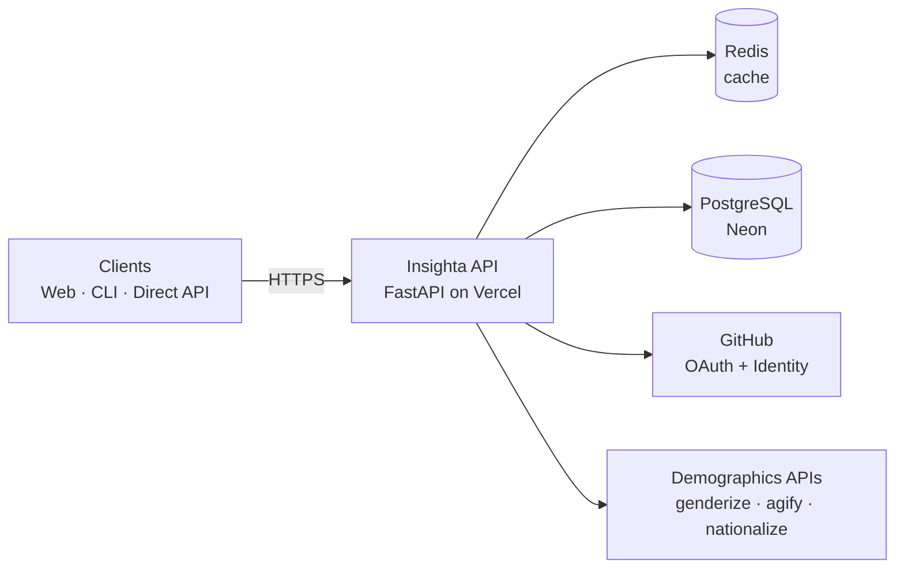
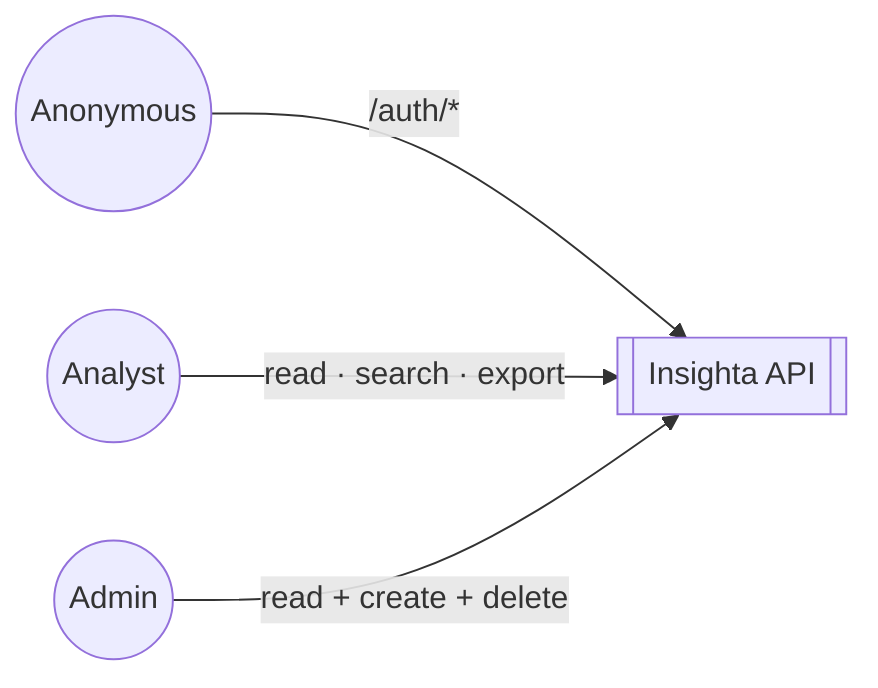
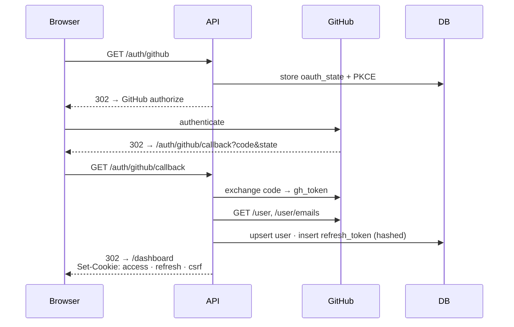
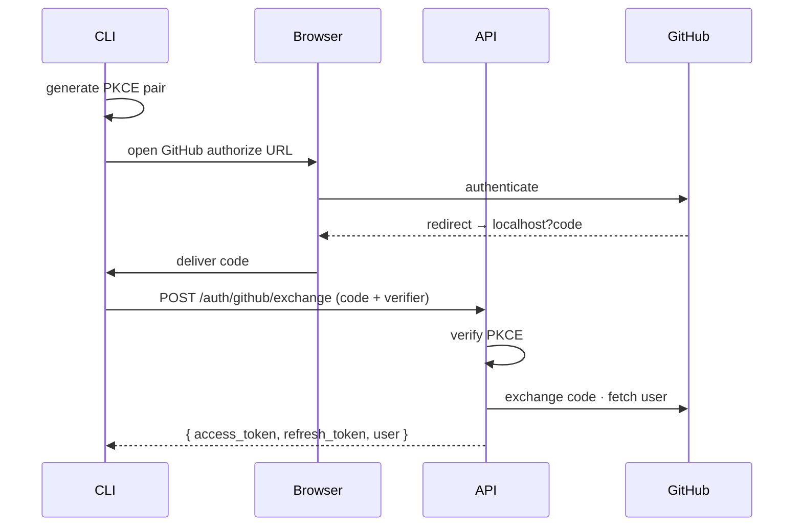
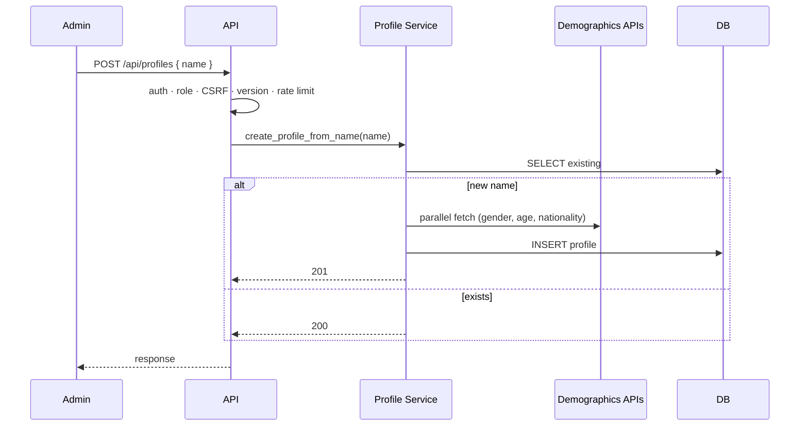
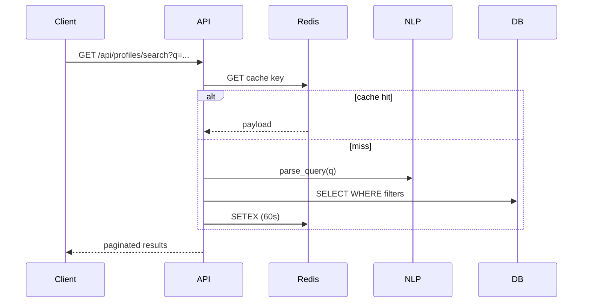
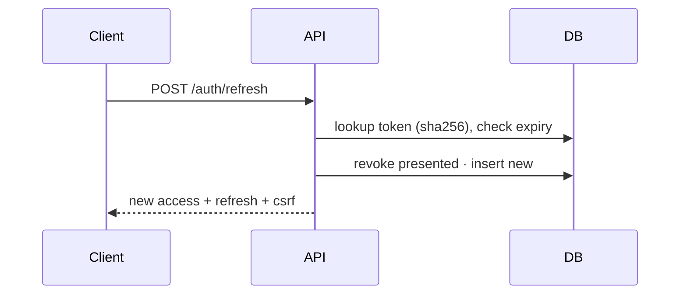
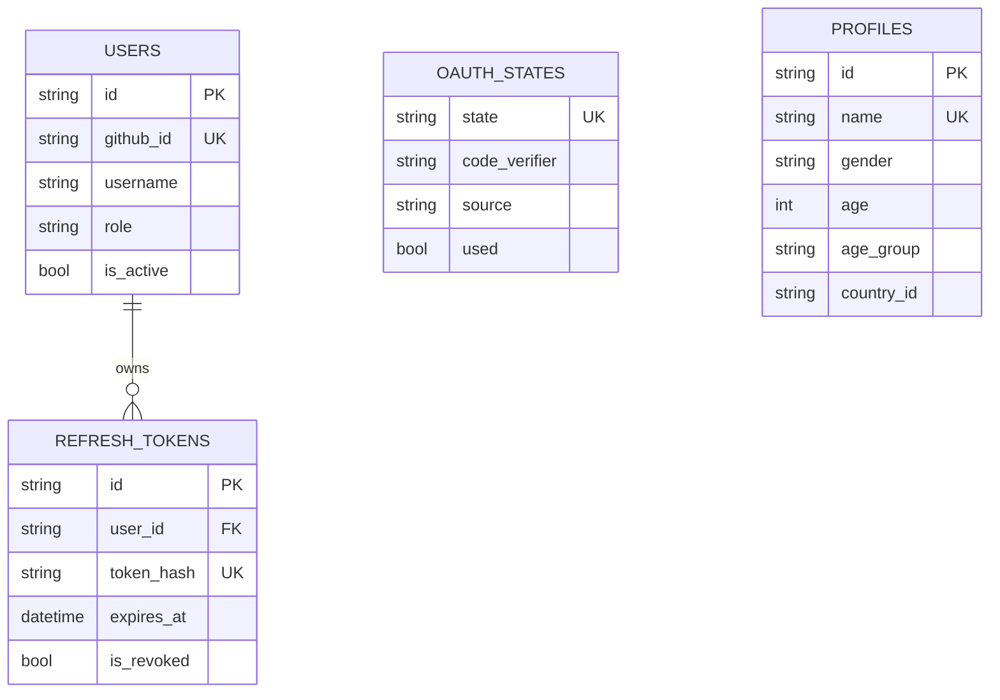
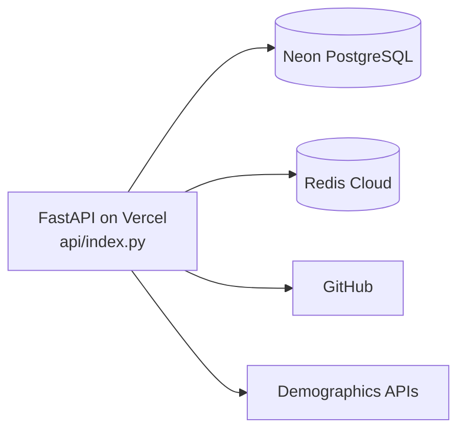

# Insighta Labs+ — Architecture

A FastAPI-based profile intelligence API. Users authenticate via GitHub OAuth (web cookie or CLI PKCE); admins create demographic profiles by name (enriched via 3 external APIs) and analysts read/search them. Deployed as a Vercel serverless function backed by Neon PostgreSQL.

---

## 1. High-Level Component Diagram

| Component | Role |
|---|---|
| **Clients** | Web (cookie + CSRF), CLI (Bearer + PKCE), direct API |
| **Insighta API** | Stateless FastAPI app — auth, authorization, profile CRUD, NLP search |
| **Redis** | Read-through cache for `GET /api/profiles` and `/search`; invalidated on writes. Optional — falls back to DB if `REDIS_URL` is unset |
| **PostgreSQL** | Single source of truth: users, profiles, refresh tokens, oauth states |
| **GitHub** | OAuth identity provider |
| **Demographics APIs** | External enrichment to build profiles from a name |

---

## 2. Actors & Authorization

Every protected request runs through: **identity** (JWT or cookie) → **role** (`require_admin` on writes) → **CSRF** (cookie writes only) → **API version** (`X-API-Version: 1`) → **rate limit** (10/min on `/auth/*`, 60/min on `/api/*`).

---

## 3. Sequence — Web Portal OAuth Login

---

## 4. Sequence — CLI Login (PKCE)

---

## 5. Sequence — Admin Creates a Profile

---

## 6. Sequence — Natural-Language Search (cached)

---

## 7. Sequence — Refresh-Token Rotation

---

## 8. Data Model

---

## 9. Deployment

Single-region, stateless serverless function. Durable state in Neon; ephemeral cache in Redis. No background workers — every workflow is request-scoped.
